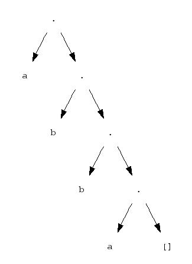
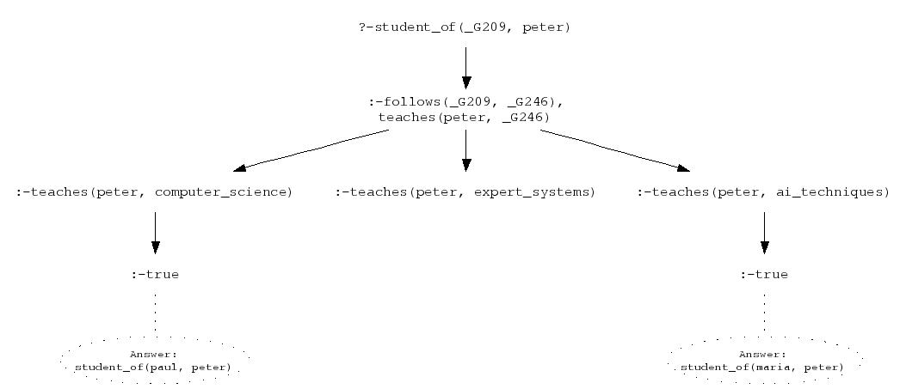

# Visualising terms and SLD trees with Graphviz #
[Graphviz](http://www.graphviz.org/) is a collection of programs for visualising graphs. Here, we conveniently use it for visualising Prolog terms and SLD trees.  
Download the file [`graphviz.pl`](graphviz.pl). This file defines the two main predicates `term/1` and `sld/1`. The query `?-term(Term)`, where `Term` is bound to a Prolog term, will produce a file `term.dot`, which defines a tree in Graphviz format. For example, the query `?-term([a,b,b,a])` produces the following Graphviz input:

    digraph {
    node [shape=plaintext, fontname=Courier, fontsize=12]
    0 [label="."];
    1 [label="a"];
    0 -> 1;
    2 [label="."];
    0 -> 2;
    3 [label="b"];
    2 -> 3;
    4 [label="."];
    2 -> 4;
    5 [label="b"];
    4 -> 5;
    6 [label="."];
    4 -> 6;
    7 [label="a"];
    6 -> 7;
    8 [label="[]"];
    6 -> 8;
    }

The command `dot -T jpg -o term.jpg term.dot` then produces a JPEG file with the following tree:

See [here](http://www.graphviz.org/pub/scm/graphviz2/doc/info/command.html) for more information about how to use Graphviz programs from the command line.

Similarly, the query `?-sld Goal`, where `Goal` is bound to a Prolog goal, will produce a file `sld.dot`, which defines a tree in Graphviz format (notice that `sld/1` has been defined as a prefix operator and can thus be used without brackets). For example, the query `?-sld student_of(S,peter)` produces the following tree when run through `dot`:\

Now, try the example queries `?-term2` and `?-sld2` that have been pre-defined in `graphviz.pl`.

The Graphviz binaries can be found in `/usr/local/ml/graphviz/2.6/bin/`. You can add this to your path so that you can easily use the Graphviz commands from the command line.
